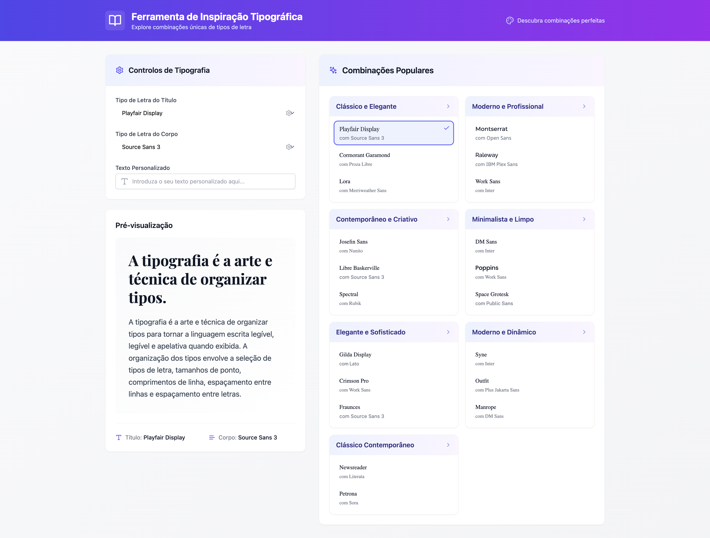

# Combinações Tipográficas

Combinações Tipográficas - Teste combinações tipográficas facilmente!
É uma web app desenvolvida para designers gráficos e web que precisam experimentar e testar combinações de fontes para seus projetos. Simples, rápido e eficaz, o "Tipografias" oferece uma interface intuitiva para visualizar como diferentes pares de fontes funcionam juntos em textos de exemplo.




Recursos:
- Adicione fontes personalizadas ou selecione da biblioteca padrão (incluindo Google Fonts).
- Visualize combinações em tempo real.
- Exporte suas combinações favoritas para uso direto em seus projetos.
- Explore. Teste. Crie!
- Dê vida às suas ideias tipográficas com o Tipografias.

## Atualização automática do repositório analisado

Você pode atualizar o repositório automaticamente com o script incluído no projeto:

```bash
npm run repo:update
```

Esse comando executa uma atualização única (`git fetch --prune` + `git pull --ff-only`) no branch atual.

Se quiser atualização contínua em intervalo fixo (ex.: a cada 5 minutos):

```bash
./scripts/auto-update-repo.sh 300
```

### Rodando em background (Linux/macOS)

```bash
nohup ./scripts/auto-update-repo.sh 300 > repo-update.log 2>&1 &
```

### Exemplo com cron (a cada 15 minutos)

```cron
*/15 * * * * cd /caminho/do/repositorio && /usr/bin/bash ./scripts/auto-update-repo.sh
```

O conteúdo está disponível sob a licença Creative Commons Attribution-NonCommercial-ShareAlike 4.0 International, permitindo a partilha e adaptação, desde que seja atribuído o devido crédito, para fins não comerciais, e com distribuição sob os mesmos termos. Juntos, construímos um mundo mais inclusivo e acessível.
Para mais informações sobre a licença, visite: https://creativecommons.org/licenses/by-nc-sa/4.0/

Autoria: Patrício Brito @ 2024
